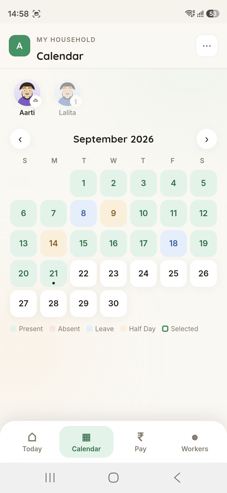

# Household Help

A production Progressive Web App for tracking domestic worker attendance, salary calculation, and advance payments — built for real household use, not a demo.

**Live app:** https://chatgpt-household-attendance.firebaseapp.com *(private — invite-only per household)*

  
  
  

## What it does

*Read the full build story, including the debugging process: [docs/case-study.md](docs/case-study.md)*

Most households paying domestic workers track attendance and pay on paper, in a notebook, or in someone's head. This app replaces that with a mobile-first tool that handles the actual complexity of the problem:

- **Daily attendance**, per worker, per shift (single visit or morning + evening)
- **Bulk attendance editing** — select a range of dates (tap, drag, or both combined) and mark them all at once, with a protection dialog if any selected dates already have data
- **Shift-aware salary calculation** — monthly-salary or daily-rate workers, a configurable paid-leave allowance, automatic deduction for leave beyond that allowance, "Half Day" derived automatically from partial shift attendance (never entered directly)
- **Salary advances** — record money given to a worker ahead of settlement, tied to a specific recovery month, automatically deducted from that month's payable amount, with full history and partial-recovery support
- **Actual payment tracking**, kept deliberately separate from the calculated amount — what you *owe* and what you *paid* are different numbers, and the app never conflates them
- **Multi-user households** — invite another Google account (e.g. a spouse) to share the same data

## Tech stack

- **Frontend:** Vanilla JavaScript (ES modules), no framework — hand-rolled SPA routing and rendering
- **Backend:** Firebase Authentication (Google Sign-In) + Firestore (NoSQL, household-scoped multi-tenant data model)
- **Hosting/CI-CD:** Firebase Hosting, auto-deployed via GitHub Actions on every push to `main`
- **Design system:** custom illustrated SVG avatar system (no photos, no emoji), hand-built component library, no CSS framework

## Architecture notes

**Multi-tenant by household, not by user.** Every worker, attendance record, and settlement belongs to a `households/{id}` document. A household has an owner and a `memberEmails` array; Firestore security rules gate every read/write on membership, not on individual ownership — so two people can share one household's data with equal access.

**Attendance is the single source of truth.** There's exactly one `attendance` collection (one document per worker, per date, with `morning`/`evening` fields). Bulk editing, the daily attendance screen, the calendar, and every salary calculation all read from and write to this same collection — there's no separate "bulk attendance" data structure duplicating it.

**Salary calculation is intentionally transparent, not a black box.** For a monthly-salary worker, the app shows: monthly salary → daily allocation → unpaid-leave deduction → calculated payable → advance recovery → final amount. Every number is visible and traceable back to its inputs, rather than collapsing into one opaque total.

**Advances are recovered, not just recorded.** An advance links to a specific recovery month. Recovery is capped at whatever's actually payable that month (you can't deduct more than what's being paid out), multiple advances for the same worker/month recover oldest-first, and recovery only commits permanently the moment an actual payment is recorded — not just from previewing a future month's numbers.

## Engineering notes worth reading

A few problems that came up during development and how they were resolved — the kind of judgment calls that don't show up in a feature list:

- **A caching bug silently hid a shipped feature.** Firebase Hosting's cache headers only forced fresh loads for two of six app files. A major feature (salary advances) was fully built and deployed, but browsers kept serving a stale, pre-feature version of the stylesheet and one script — so the feature looked entirely missing on real devices for a full review cycle. Root-caused by systematically comparing what should have changed against what was actually rendering, not by guessing.
- **A one-line CSS bug had been present since the very first version of a screen** — a class used in the markup with no matching style rule, invisible with only two short labels, glaringly obvious once the same screen needed to show six. Found by writing a small script that cross-references every CSS class used anywhere in the codebase against every rule actually defined, rather than fixing the one visible symptom and hoping nothing else was affected.
- **Mobile drag-to-select needed a different approach than the "obvious" one.** A calendar date-range selector built with `pointerenter` per-cell looks correct on desktop and silently fails on touchscreens, because touch's implicit pointer capture means those events never fire for cells you drag over. Rebuilt using `elementFromPoint()` during `pointermove` instead — the actual reason mobile drag-select breaks when built the naive way.

## License / usage

Personal project — Firestore security rules restrict data access to invited household members only. Code is here for reference and portfolio purposes.
