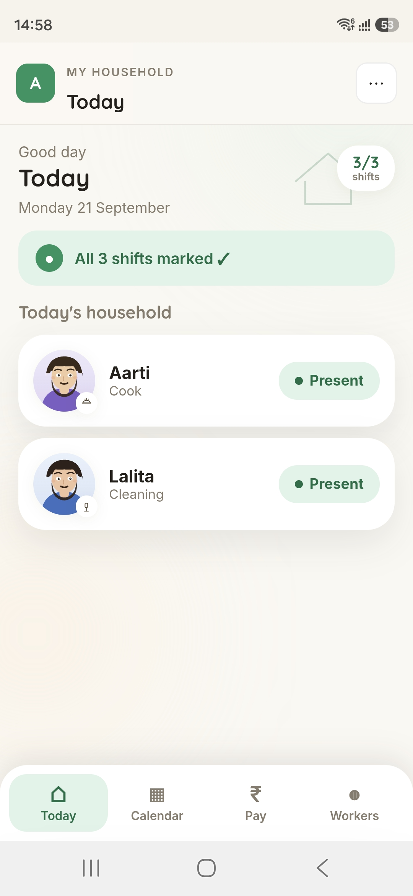
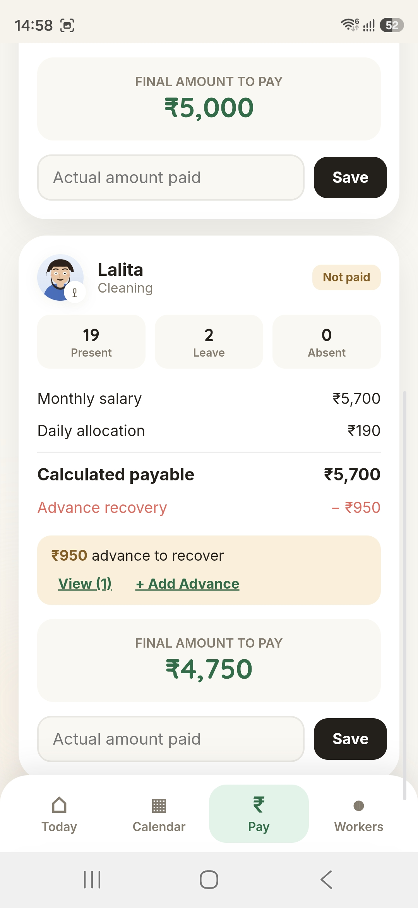

# Building a production app end-to-end with AI — a case study

I set out to solve a real problem: my household pays a few domestic workers, and attendance, leave, and salary settlement were all tracked in my head and on paper. Half-days weren't calculated consistently, advances got forgotten, and "how much do I actually owe this month" was never a fast answer.

So I built **Household Help** — a full production Progressive Web App, from architecture through deployment, working with Claude as my development partner throughout. Here's what that process actually looked like, and what I think is worth sharing about it.

## It's not "vibe coding" — it's a real development process

The build went through the same phases any serious project would, just compressed:

**Design before code.** Every major UI change — the four-screen navigation, the bulk-attendance calendar, the salary breakdown — started as an interactive HTML mock with fake data, reviewed on my actual phone, before a single line touched the production Firestore-connected app. One redesign pass even got an independent review from a second AI (GPT) before implementation, specifically to catch things I might have missed.

**Real architecture decisions, not defaults.** The data model is multi-tenant by household, not by user — a household has an owner and invited member emails, and Firestore security rules gate every read/write on membership. Salary calculation had to reconcile a genuinely tricky question: should marking a worker "Absent" reduce a monthly salary, or only "Leave" beyond a paid allowance? The existing production formula only did the latter — a real conflict between the initial feature spec and the live calculation engine that had to be surfaced and explicitly resolved, not silently coded around.

**Bugs get found by process, not luck.**

Two examples I'm genuinely proud of catching before they became "why doesn't this work" complaints:

- A major feature — salary advances — was fully built, tested, and deployed. It looked completely missing on the live app. The cause: Firebase Hosting's caching rules only forced a fresh reload for two of six app files; the browser was silently serving a stale, pre-feature version of everything else. Found by comparing what *should* have changed against what was actually rendering, then fixing the caching configuration itself so the whole class of bug couldn't recur.
- A button had literally never been styled, since the very first version of the screen it lived on — invisible with two short labels, glaringly broken once the same UI needed six. I didn't just fix the one visible symptom; I wrote a small script that cross-references every CSS class used anywhere in the codebase against every style rule that actually exists, to find anything else hiding the same way. It found exactly one thing, fixed it, and confirmed full coverage afterward.

## What's actually in it

- Shift-aware attendance (single visit or morning + evening), with "Half Day" always *derived* from partial shift data, never entered directly
- Bulk date selection on a real touch calendar — tap, drag-range, or both combined — with a protection dialog before overwriting existing records
- Transparent salary calculation: salary → daily allocation → deduction → calculated payable → advance recovery → final amount, every number traceable, never collapsed into one opaque total
- A full advance-tracking system: record money given ahead of settlement, tied to a specific recovery month, automatically deducted, with partial recovery and history
- Actual payment tracking kept deliberately separate from what's calculated — what you owe and what you paid are different facts, on purpose
- Google Sign-In, multi-user households, and a CI/CD pipeline that deploys to Firebase automatically on every push to `main`

## The honest part

Working with AI on a production system doesn't remove the need for engineering judgment — it changes where that judgment gets applied. The most valuable moments in this build weren't "AI writes code fast," they were the points where a claimed fix got traced line-by-line before shipping, where a conflict between a new requirement and existing production logic got surfaced instead of silently overwritten, and where "it looks done" got replaced with "here's exactly how I verified it's done." That's the actual skill I'd want this project to demonstrate.

**Live app:** https://chatgpt-household-attendance.firebaseapp.com
**Code:** https://github.com/Abhishek-Chaudhary-dev/household-attendance-app

Happy to talk through any part of the architecture, the calculation engine, or the deployment setup.
